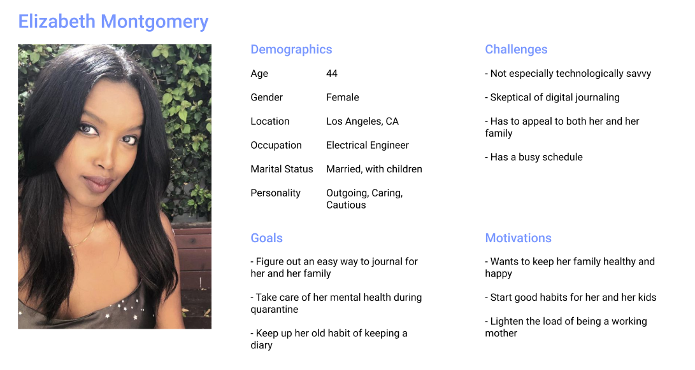
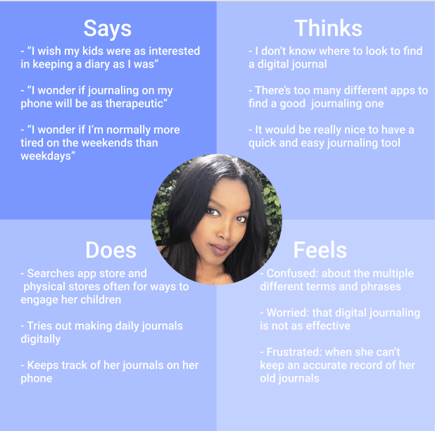
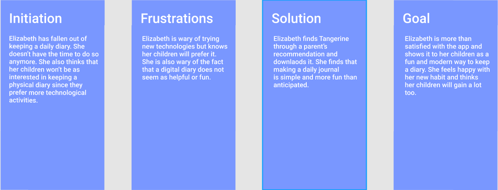
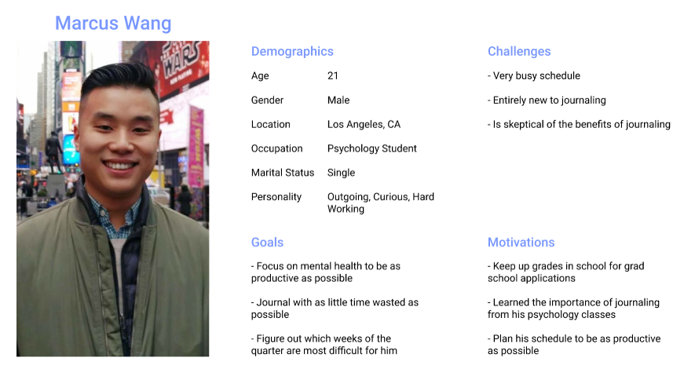
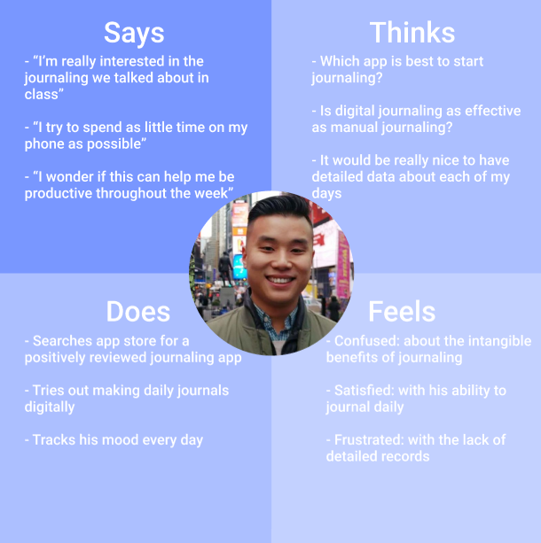
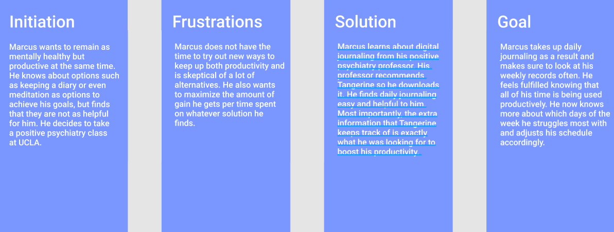

# Assignment-05: Persona + Scenarios by Tai Nguyen
## The Purpose of UX Storytelling
My project revolves around the effects of journaling on mental health of users. However, to understand what kind of effects journaling can and should have on users' mental health, it is necesary to understand the user itself. Therefore, the purpose of UX storytelling in my project in particular is to get within the mind of the user and understand how they may think and feel about certain aspects of journaling and the resulting effects. It also gives an idea for me to understand how to make journaling easiest and most effective for the targeting users.
## Design Features
1. Creating a daily journal
2. Viewing records of mood from a month ago
## Persona + Empathy Map 1

## Scenario + Journey Map 1
### Elizabeth's Scenario
Elizabeth is a mom working full time as an electrical engineer. Her main priority is staying connected to her children despite her very busy schedule. She prioritizes their mental health and being as open with them as possible. She used to have a diary growing up and misses doing so. She thinks that journaling again would be really good for herself and be a good habit and bonding exercise for herself and her children. She also hopes that journaling will help her kids be more open with her. 
Elizabeth finds Tangerine through another parent's recommendation and downloads the app. She only really cares about the journaling part of the app and begins to create a daily journal. She finds the process to be similar to keeping a diary but with extra features as well. Elizabeth feels good about introducing this to her children. 

## Persona + Empathy Map 2

## Scenario + Journey Map 2
### Marcus's Scenario
Marcus is a psychology student at UCLA. He spends almost all of his time studying, going to classes, and volunteering at a lab. He is motivated to stay as productive as possible to get into his dream grad school. However, he is also aware of the importance of staying mentally healthy and takes a positive psychiatry class. He learns about the multiple studies proving the benefits of keeping a daily journal. In addition, he thinks that keeping detailed records of his days can teach him more about how to improve his day to day activities.
Marcus asks his professor for a recommendation on how to start journaling. His professor recommends him Tangerine. He tries it out and finds that not only is the process extremely simple, but there is more information than just his own thoughts that are recorded. He is happy to find out his specific moods, habits, and other day to day information is recorded and visualized. 

